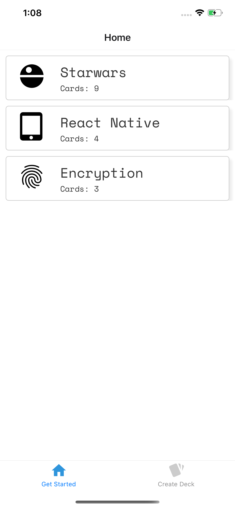
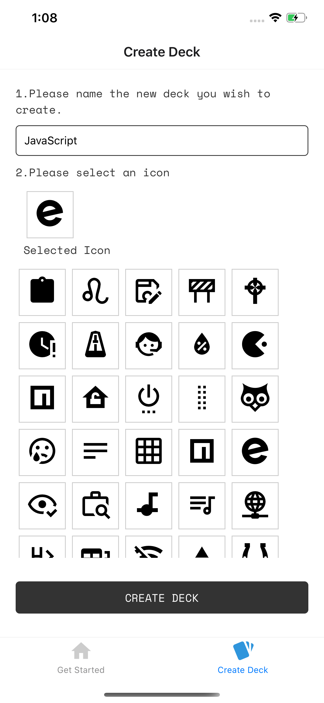
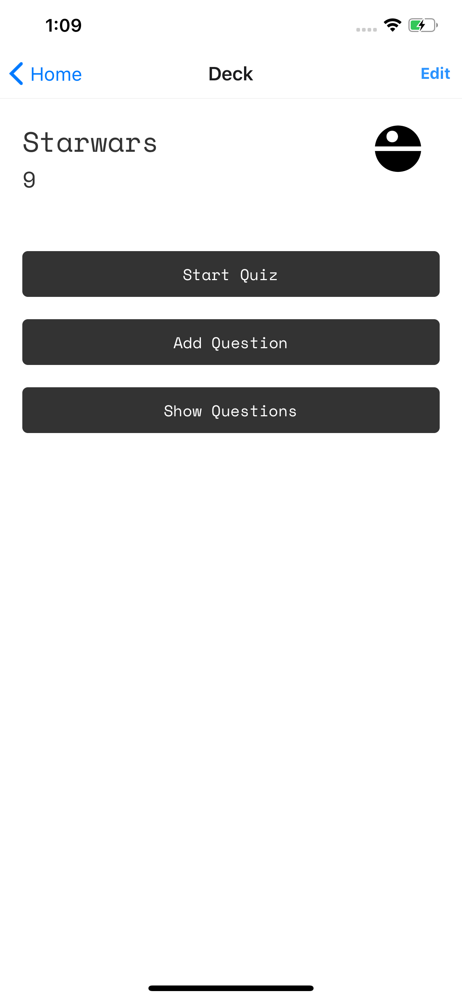

# Mobile Flashcards

Flash card study app, developed with react native. Lets you create study flashcards organized by decks.

---

## How to install

`npm install`

## How to run

`npm run start`

---

## Support

### Tested on the following platforms

- iOS
- Android

---

## Preview

---

### [License](LICENSE)
